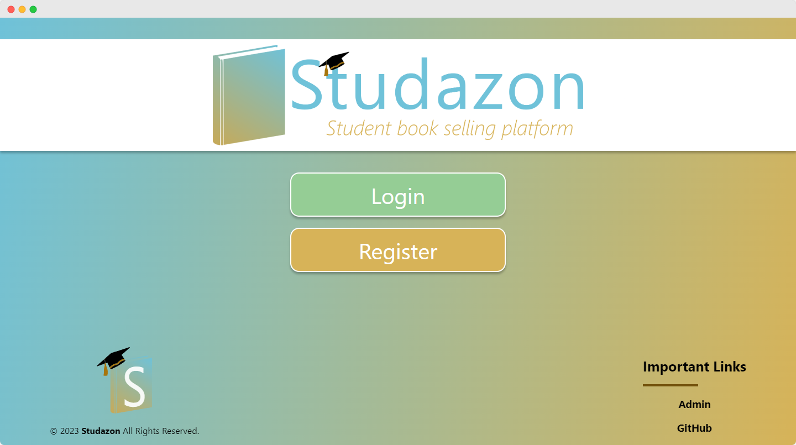
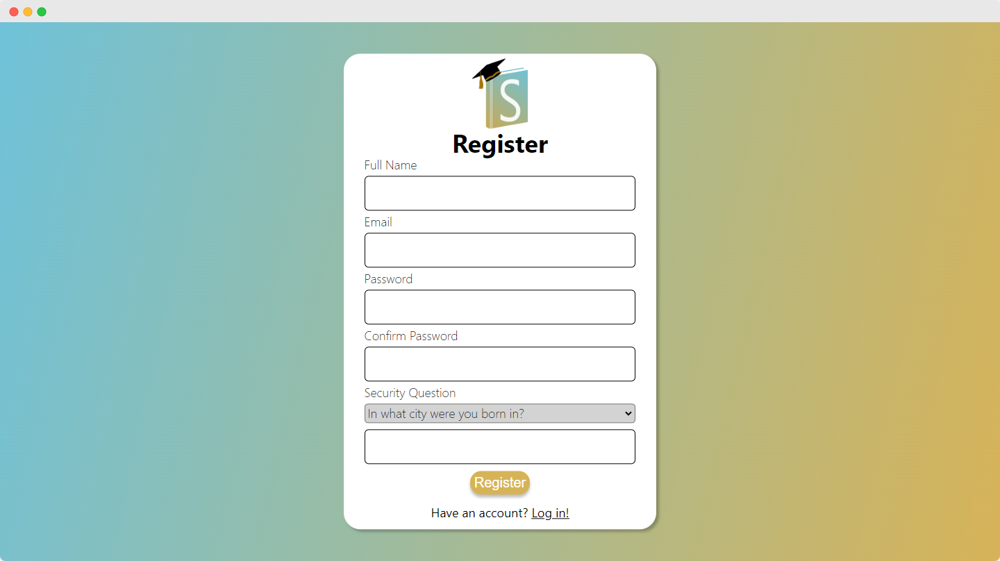

 


<h1 align="center">Welcome to Studazon 👋</h1>
<p>
  
</p>

> This web application provides a platform for college students to easily find, buy, and sell textbooks to other students. With a user-friendly interface, students can create listings for the textbooks they wish to sell and search for textbooks they need for their courses. This application streamlines the process of buying and selling textbooks, making it easier and more convenient for students to get the textbooks they need for their studies. Whether you're looking to get rid of old textbooks or buy textbooks for your upcoming courses, this web application offers a simple and efficient solution for all of your textbook needs.

### 🏠 [Homepage](http://18.206.192.122:8080/studazon/)

### ✨ [Demo](http://18.206.192.122:8080/studazon/)

<br>

## Authors
<hr>

👤 **Michelle Thoi**

* Github: [@MichelleThoi](https://github.com/MichelleThoi)
* LinkedIn: [@MichelleThoi](https://linkedin.com/in/michelle-thoi-mt25)

👤 **Umang Patel**

* Website: https://ukpatell.com
* Github: [@UKPatell](https://github.com/ukpatell)
* LinkedIn: [@UKPatel](https://linkedin.com/in/ukpatel)

👤 **Gavin Minney**

* Github: [@GMinney](https://github.com/gminney)
* LinkedIn: [@GMinney](https://linkedin.com/in/gminney)

👤 **Gage Stevens**

* Website: https://www.gismogames.io/
* Github: [@Gage-Stevens](https://github.com/GismoGaming)
* LinkedIn: [@Gage-Stevens](https://linkedin.com/in/gage-stevens)

<br>

## Features
<hr>
✔️ Users are able to register for an account and login securely<br>
✔️ Password reset management functionality via email<br>
✔️ Users can create a listing of their textbook on the platform to put up for sale<br>
✔️ Interested buyers can send their interest to the seller for a listing<br>
✔️ Users are able to search for a particular listing via Title, Author, ISBN etc.<br>
✔️ Users are able to update their profile from their account<br>


## Technology
<hr>
<table>
<tr>
<th>Area</th>
<th>Technology</th>
<th>How it was used</th>
</tr>
<tr>
<td>Cloud Service Provider</td>
<td>Amazon Web Services</td>
<td>t2.micro EC2 instance with Ubuntu 22.04.2 LTS (Jammy Jellyfish) was used to host live server</td>
</tr>
<tr>
    <td>Front End</td>
    <td>JSP, CSS, Javascript</td>
    <td>Java Servlet Pages, along with CSS and JS were used for the User Interface</td>
</tr>
<tr>
    <td>Back End</td>
    <td>Java</td>
    <td>Java 17.0.2 was used for servlet requests and logic behind the system</td>
</tr>
<tr>
    <td>Server</td>
    <td>Apache Tomcat 10.0</td>
    <td>HTTP server for Java Servlet & Pages</td>
</tr>
<tr>
    <td>Database</td>
    <td>MySQL 8.0.28</td>
    <td>db.t3.micro hosted onn AWS</td>
</tr>
<tr>
    <td>Mail Server</td>
    <td>SendinBlue</td>
    <td>The project utilized the SendinBlue email delivery platform as the SMTP server for sending transactional emails. </td>
</tr>
<tr>
    <td>UI / UX</td>
    <td>Figma</td>
    <Td>Figma was used for creating wireframes and mockups.</Td>
</tr>
</table>

## Usage
<hr>

#### Visit the Studazon 


#### Register for an acccount


#### Login


#### Welcome email sent by the system, highlighting the uses of application


#### Dashboard to browser for existing listings


### Create a listing
```
1. Click on the "Create Listing" button
2. Enter the details of the textbook (title, author, ISBN, etc.)
3. Upload a photo of the textbook
4. Set the price and condition of the textbook
5. Click "Submit" to create the listing
```


### Express Interest in a listing
```
1. Browse the results and click on a listing to view more details
2. Click "Send Interest" or (blue note with + sign) for "Send Interest with Notes" to express interest in the listing
```


## Installation
<hr>

####  To run Studazon locally, follow these steps:

1. Install Java 17.0.2 and Apache Tomcat 10.0 on your local machine.
2. Install MySQL 8.0.28 and create a new database for Studazon.
3. Clone the Studazon repository to your local machine.
4. Import the Studazon database schema to your MySQL database.
5. Update the database connection details in the `resources/database.properties file.`
6. Update the mailer connection details in the `resources/mail.properties file.`
7. Build the project using mvn clean install.
8. Deploy the `target/studazon.war` file to your Apache Tomcat server.
9. Access the Studazon application at http://localhost:8080/studazon/.

<hr>

## Show your support


Give a ⭐️ if this project helped you!

